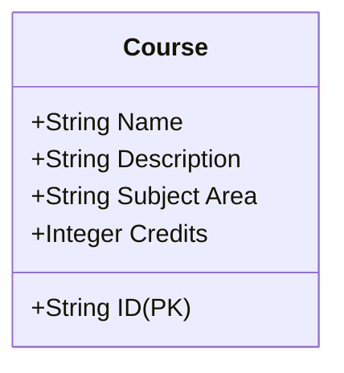
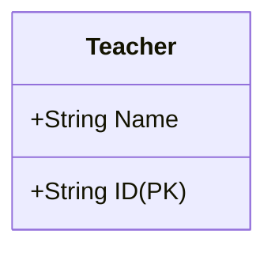

# SDEV-255-M08-Final-Project
These models and API definitions are structured to efficiently handle the operations related to managing courses and teachers within a database or a server application.
Below are the Courses and Teachers data models represented as tables and a diagram, followed by an outline of the API endpoints in a table format.

### Courses Data Model

#### Diagram (Mermaid)


#### Table (Markdown)
| Field         | Data Type | Description                             | Constraint    |
|---------------|-----------|-----------------------------------------|---------------|
| ID            | String    | Unique identifier for the course        | Primary Key   |
| Name          | String    | The name of the course                  | Required      |
| Description   | String    | A detailed description of the course    | Required      |
| Subject Area  | String    | The subject area the course pertains to | Required      |
| Credits       | Integer   | Number of credits the course is worth   | Required      |

### Teachers Data Model

#### Diagram (Mermaid)


#### Table (Markdown)
| Field | Data Type | Description                             | Constraint    |
|-------|-----------|-----------------------------------------|---------------|
| ID    | String    | Unique identifier for the teacher       | Primary Key   |
| Name  | String    | Full name of the teacher                | Required      |

### Task 2: Build Backend API

#### API Endpoints Table (Markdown)

##### Courses API

| Method | Endpoint            | Description                            |
|--------|---------------------|----------------------------------------|
| POST   | `/courses`          | Create a new course                    |
| GET    | `/courses`          | Retrieve all courses                   |
| GET    | `/courses/:id`      | Retrieve details of a specific course  |
| PUT    | `/courses/:id`      | Update a specific course               |
| DELETE | `/courses/:id`      | Delete a specific course               |

##### Teachers API

| Method | Endpoint          | Description                |
|--------|-------------------|----------------------------|
| POST   | `/teachers`       | Register a new teacher     |
| POST   | `/auth/login`     | Authenticate a teacher     |


---

This task list provides a roadmap for developing a comprehensive course management and student registration system. Adjustments may be needed based on testing feedback and evolving project requirements.

### **Stage 1: Development of Course Management System**

#### **Task 1: Define Data Structures**
- Define the data model for courses, including attributes like course name, description, subject area, and number of credits.
- Define the data model for teachers.

#### **Task 2: Build Backend API**
- Create API endpoints to create, view, edit, and delete courses.
- Implement authentication for teachers to ensure only signed-in teachers can manipulate course data.

#### **Task 3: Frontend Development**
- **Page 1: Course Creation and Index**
  - Design and implement a form for adding new courses.
  - Create an index page listing all courses with options to edit or delete them.
- **Page 2: Individual Course View**
  - Design and implement a page to view details of an individual course.

#### **Task 4: Initial Setup and Testing**
- Set up database and server configurations.
- Perform initial testing of CRUD operations for courses.
- Implement basic navigation and partial design of the site.

#### **Deliverables for Stage 1**
- Functional course addition and management interface.
- Active links and navigable pages between course listings and individual course views.
- Initial design elements established on the website.

### **Stage 2: Student Interaction and Course Scheduling**

#### **Task 1: Student Authentication and Registration**
- Implement a user authentication system with different permissions for students and teachers.
- Allow students to register and manage their profiles.

#### **Task 2: Course Enrollment System**
- Create a system where students can search for courses by name or number.
- Develop features for students to add courses to their schedule.

#### **Task 3: Manage Course Enrollment**
- Allow students to view their current course schedule.
- Implement functionality for students to drop courses from their schedule.

#### **Task 4: Testing and Refinement**
- Thorough testing of student login, registration, course addition, and drop features.
- Ensure proper authorization checks are in place to differentiate student and teacher capabilities.

#### **Deliverables for Stage 2**
- A working login system with session management.
- Differentiated user permissions between students and teachers.
- Functionalities for students to manage their course schedules effectively.

### **Additional Considerations**
- Ensure responsive design for accessibility across different devices.
- Implement security measures, such as SSL encryption and secure password storage.
- Plan for future scalability in both the backend and frontend architectures.

### **Follow-Up Tasks**
- After the completion of both stages, conduct user testing with real users to identify usability issues and bugs.
- Prepare documentation for the system usage and maintenance.


### Step 1: Modify the Table to Add Courses Dynamically
```html
<div class="container mx-auto px-4 sm:px-6 lg:px-8 py-8">
    <h2 class="text-2xl font-bold mb-4">Courses Datatable</h2>
    <table id="coursesTable" class="table-auto w-full">
        <thead>
            <tr>
                <th class="px-4 py-2">Course Name</th>
                <th class="px-4 py-2">Description</th>
                <th class="px-4 py-2">Subject Area</th>
                <th class="px-4 py-2">Credits</th>
                <th class="px-4 py-2">Teacher</th>
            </tr>
        </thead>
        <tbody>
            <!-- Courses will be added here dynamically -->
        </tbody>
    </table>
</div>
```

### Step 2: JavaScript to Add Courses to the Table

```javascript
function addCourseToTable(course) {
    const table = document.getElementById('coursesTable').getElementsByTagName('tbody')[0];
    const newRow = table.insertRow(table.rows.length);
    newRow.innerHTML = `
        <td class="border px-4 py-2">${course.name}</td>
        <td class="border px-4 py-2">${course.description}</td>
        <td class="border px-4 py-2">${course.subject}</td>
        <td class="border px-4 py-2">${course.credits}</td>
        <td class="border px-4 py-2">${course.teacher}</td>
    `;
}
```

### Step 3: Create a Similar Setup for Student Registration

```html
<div class="container mx-auto px-4 sm:px-6 lg:px-8 py-8">
    <h2 class="text-2xl font-bold mb-4">Student Registrations</h2>
    <table id="studentsTable" class="table-auto w-full">
        <thead>
            <tr>
                <th class="px-4 py-2">Student Name</th>
                <th class="px-4 py-2">Course Enrolled</th>
            </tr>
        </thead>
        <tbody>
            <!-- Students will be added here dynamically -->
        </tbody>
    </table>
</div>
```

### Step 4: JavaScript to Add Students to the Course Table

Similarly, create a function to add student registrations:

```javascript
function addStudentToCourse(student) {
    const table = document.getElementById('studentsTable').getElementsByTagName('tbody')[0];
    const newRow = table.insertRow(table.rows.length);
    newRow.innerHTML = `
        <td class="border px-4 py-2">${student.name}</td>
        <td class="border px-4 py-2">${student.course}</td>
    `;
}
```

### Step 5: Initialize Data Tables

Initialize the DataTables plugin for both tables in your existing DataTables setup:

```javascript
$(document).ready(function() {
    $('#coursesTable').DataTable();
    $('#studentsTable').DataTable();
});
```
